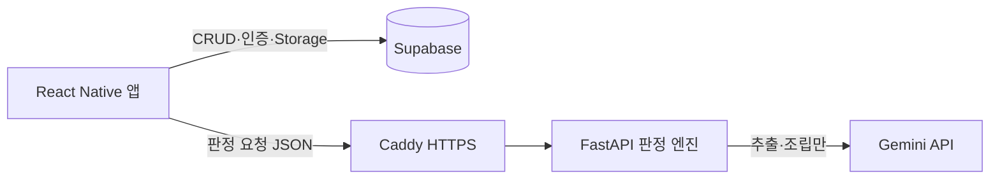

# Keepsy 판정 엔진

청소년 알바생의 근로계약서·근무기록에서 **노동권익 침해를 판정**하고 진정서 초안까지 만들어 주는 무상태 계산 서버. GEEKs 해커톤 2026 출품작 Keepsy의 백엔드로, FastAPI 기반 JSON in/out — **DB 없음, 캐시 없음, 인증 없음.**

## 아키텍처 — "기록은 Supabase, 판단은 엔진"



- 데이터 소유는 전부 프론트↔Supabase 직접. 엔진은 요청에 담긴 데이터만 보고 **매번 전체 재계산**한다.
- 엔진이 무상태·DB 없음인 이유: 판정 결과가 항상 최신 기록을 반영해야 하고(수정·삭제 즉시 반영), 상태가 없으면 검증·배포·재현이 단순해진다. 판정 캐시가 필요하면 프론트가 Supabase(`contracts.verdict`)에 저장한다.

## 핵심 설계 원칙 3가지

1. **AI는 읽기·쓰기만, 판단은 100% 결정론 코드.** Gemini는 계약서 → 구조화(추출)와 진정서 고정 문형 조립에만 관여한다. 위법 판정(`rules/`), 체불액·시효 계산(`services/`)은 순수 파이썬이라 **환각이 판정에 개입할 통로가 없다.** 법령 수치는 `constants.py`에서만 읽는다.
2. **모르면 확정하지 않는다.** 등급은 `RED`(확정 위반)/`YELLOW`(검토 필요)/`INFO`(안내) 3단계. 정보가 부족하면(시급 미입력, 단순노무 여부 미상, 프리랜서 계약, 공제 미상) RED 대신 YELLOW로 강등하고 사유를 `notes`/`assumptions`로 고지한다. 그럴듯한 값을 채우는 것이 최악의 실패라는 전제.
3. **정답은 fixtures가 정의한다.** `fixtures/`의 샘플 계약서·근무기록과 기대 판정(그라운드 트루스)이 곧 완료 기준 — 모든 변경은 `pytest -q` 통과로만 "완료"를 주장할 수 있다.

## 디렉토리 구조

| 경로 | 책임 (상세는 각 파일 Docstring) |
| --- | --- |
| `app/main.py` | 앱 조립·CORS·공통 에러 핸들러·`/health` |
| `app/schemas.py` | `docs/API_SPEC.md`의 Pydantic 번역 (snake_case, 날짜·시각은 KST 문자열) |
| `app/constants.py` | 법령 상수의 유일한 원본 (오너 검증 값만) |
| `app/routers/` | 엔드포인트 5개 — `contract.py`, `worklogs.py`, `petition.py` |
| `app/rules/` | 계약 판정 규칙 4개 + 실행기 `base.py` (순수 결정론) |
| `app/services/` | `patterns.py`(패턴·체불) · `statute.py`(시효) · `gemini.py`(추출) · `pdf.py`(진정서) |
| `app/templates/petition.html` | 진정서 고정 문형 템플릿 (WeasyPrint) |
| `fixtures/` · `tests/test_e2e.py` | 그라운드 트루스와 검증 하네스 |
| `docs/API_SPEC.md` | **유일한 API 계약 문서** |
| `deploy/` · `Dockerfile` · `Caddyfile` | 배포 (systemd 유닛 / 컨테이너 대안 / 리버스 프록시) |

## 판정 규칙 요약

| rule_id | 등급 분기 | 근거 법령 |
| --- | --- | --- |
| `minimum_wage` | 시급 < 최저임금 → RED / 시급 미입력 → 확정 안 함(notes) | 최저임금법 제6조 |
| `penalty_clause` | 위약금·손해배상 예정 조항 → RED | 근로기준법 제20조 |
| `weekly_holiday` | "주휴수당 시급 포함" 조항 → YELLOW | 근로기준법 제55조 |
| `probation` | 단순노무 감액 → RED / 요건(1년·3개월·90%) 위반 → RED, 단순노무 미상이면 YELLOW | 최저임금법 제5조 |
| (worklogs) `reduction_pattern` | 계약 <15h & 실근로 4주 평균 ≥15h → YELLOW | — (패턴 감지) |
| (worklogs) `repeated_deviation` | 동일 방향·유사 범위 이탈 4회 이상 → INFO | — (안내) |

공통 강등: `contract_type=freelance`면 전체 YELLOW + 근로자성 안내.

## API

엔드포인트 5개: `GET /health` · `POST /contract/extract` · `POST /analyze/contract` · `POST /analyze/worklogs` · `POST /petition/generate`

요청·응답 스키마는 [docs/API_SPEC.md](docs/API_SPEC.md)가 유일한 원본이며, 배포 서버의 `/docs`(Swagger UI)에서 실시간으로 확인·실행할 수 있다.

## 로컬 실행·테스트

```bash
python -m venv venv && venv/bin/pip install -r requirements.txt   # Windows: venv\Scripts\pip
venv/bin/uvicorn app.main:app --port 8000
venv/bin/pytest -q
```

환경변수(이름만 — 값은 커밋 금지): `GEMINI_API_KEY`, `ALLOWED_ORIGINS`, `AS_OF_OVERRIDE`(시연용 기준일 고정).
Gemini 없이도 판정·테스트 대부분이 돌아간다(추출 테스트만 키 필요, PDF 테스트는 Pango 필요 — 아래 배포 환경 참조).

## 배포

Ubuntu VPS 베어메탈: `deploy/keepsy.service`(systemd, venv uvicorn, `Restart=always`)가 127.0.0.1:8000에 엔진을 띄우고, 호스트의 Caddy(`Caddyfile`)가 nip.io 도메인으로 HTTPS를 자동 발급해 리버스 프록시한다 — RN 앱은 평문 HTTP가 차단되므로 HTTPS가 필수다. WeasyPrint용 Pango·`fonts-noto-cjk`(한글 렌더링) 설치 절차는 `deploy/keepsy.service` 상단 주석 참조. 컨테이너가 필요한 환경을 위한 `Dockerfile`도 유지한다.
